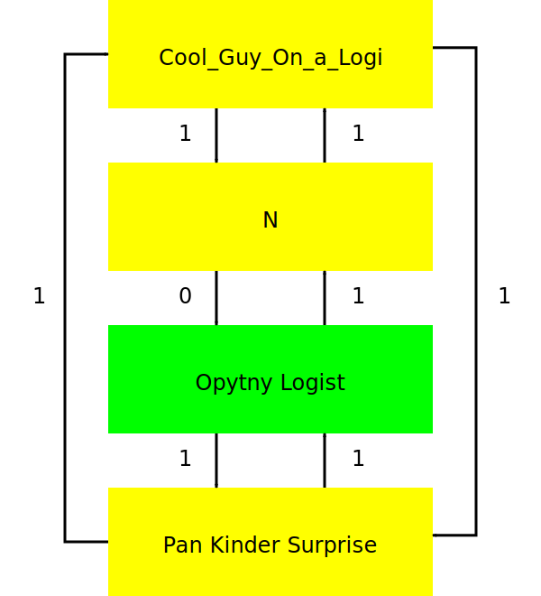

Вася-чат
========

Неотъемлемой частью работы пилота Василиска на вторжениях является построение капцепи. Без неё Василиск очень быстро сохнет и перестаёт качать щит.

Есть несколько методов построения капцепи. В сообществе RAISA принят так называемый чат Василисков ("вася-чат").

Что это
-------
Чат Василисков - отдельный чат-канал, в котором находятся все активные пилоты корабля Василиск. Список чата - порядок построения цепи.

Инструкция по применению
------------------------
При приёме в актив флота пилот Василиска заходит в указанный в шапке флота чат-канал Василисков и смотрит на список чата.

1. Пилот смотрит кто прямо над ним в списке и кто под ним в списке.
2. Если пилот в начале списка, то Василиск над ним - последний в списке, а если в конце, то под ним - в начале.
3. Пилот наливает одной каплейкой Василиску сверху всегда **вне зависимости от уровня навыка Logistics**.
4. Василиску снизу пилот наливает второй каплейкой **если у него навык Logistics IV. Если у пилота ниже навык Logistics V, то каплейка свободна**.

Практический пример
-------------------

У нас есть пилот N и он заходит в Вася-чат. Перед ним список чата:

- Cool_Guy_On_a_Logi
- N
- Pan Kinder Surprise

Предположим, что у Pan Kinder Surprise навык Logistics IV. Тогда N качает одну каплейку наверх и одну вниз.

{Cool_Guy_On_a_Logi} ←1 {N} 1→ {Pan Kinder Surprise}

Таким образом, у N нет свободных каплеек, он качает исключительно щит.

""""

Через какое-то время ФК решил взять Василиска с Logistics V под ником Opytny Logist. Вася-чат будет выглядеть вот так:

- Cool_Guy_On_a_Logi
- N
- Opytny Logist
- Pan Kinder Surprise

Pan Kinder Surprise больше не пара для N, а у Opytny Logist навык Logistics V поэтому N качает только Cool_Guy_On_a_Logi:

{Cool_Guy_On_a_Logi} ←1 {N} 0→ {Opytny Logist}

Полная капцепь
^^^^^^^^^^^^^^

- Cool_Guy_On_a_Logi - логи4
- N - логи4
- Opytny Logist - логи5
- Pan Kinder Surprise - логи4

