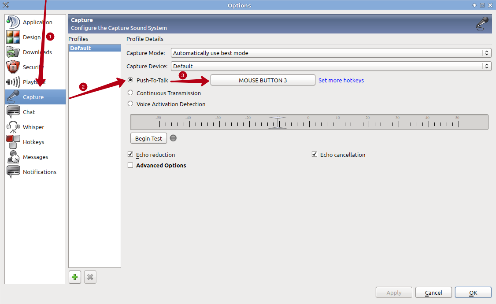

Настройка TeamSpeak
===================

1. Скачиваем последнюю версию TeamSpeak 3 - (`win32 <http://dl.4players.de/ts/releases/3.0.14/TeamSpeak3-Client-win32-3.0.14.exe>`_ - `win64 <http://dl.4players.de/ts/releases/3.0.14/TeamSpeak3-Client-win64-3.0.14.exe>`_ - `Mac <http://dl.4players.de/ts/releases/3.0.14/TeamSpeak3-Client-macosx-3.0.14.dmg>`_ - `Linux x86-64 <http://dl.4players.de/ts/releases/3.0.14/TeamSpeak3-Client-linux_amd64-3.0.14.run>`_)
2. Настроиваем микрофон:

3. Подключаемся к серверу:

.. image:: pics/TS-2.png

ВАЖНО: Ваш ник должен быть близок к игровому!
